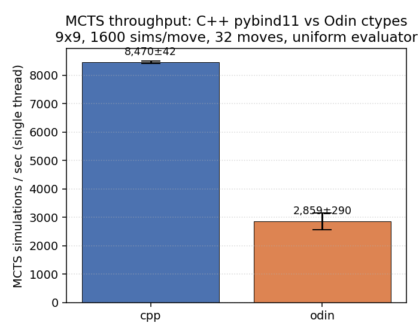

# MCTS throughput micro-bench — C++ vs Odin (NN-free)

**Date:** 2026-05-16 (PST)
**Bead:** `autogodin-ydh.2`
**Host:** CPU-only Linux box (16 cores, no GPU), `OMP_NUM_THREADS=1`, single-thread

## Setup

Backend-only comparison: same MCTS algorithm, same Python callback signature, only the implementation language behind the FFI changes.

| Knob | Value |
|------|------|
| Board | 9×9 empty start, komi 7.5 |
| Sims / move | 1600 |
| Moves / trial | 32 |
| Sims / trial | 51,200 |
| Evaluator | Deterministic uniform legal-policy + value 0.0 (no NN, no GPU) |
| `MCTSConfig` | `c_puct=1.0`, no dirichlet, no PCR, `lambda_=0`, `max_depth=100`, `temperature=1.0` |
| Action selection | `select_action(0.0)` — argmax visit count, deterministic |
| Trials | 5 timed + 1 warmup, per backend |
| Threads | `OMP_NUM_THREADS=1`, single-thread Python driver |

Both backends consume the same Python callback `(GoBoard) -> (dict[int,float], float)`; the callback returns uniform priors over legal moves + pass, value 0. With value=0 every leaf, MCTS reduces to pure UCB1-style visit-count exploration, fully deterministic given the action sequence.

## Headline

```
   cpp:   8,470 ±   42 sims/s   (95% CI, n=5)
  odin:   2,859 ±  290 sims/s   (95% CI, n=5)

  Odin / C++ = 0.338x   (-66.2%)
```



C++ pybind11 is **~3× faster per simulation** at single-thread, batch=1. Per-sim: C++ 118 µs, Odin 350 µs.

## Reading the gap

Both backends do the same algorithmic work, so the 232 µs/sim delta must live in one of three places:

1. **FFI callback cost.** Every sim crosses the FFI boundary once (Python evaluator → backend). pybind11 generates statically-typed conversion stubs (`py::dict`, `py::tuple`); the ctypes shim builds a `dict` from scratch using Python C-API calls inside a `CFUNCTYPE` trampoline. Even with identical per-call work, ctypes round-trips are several-µs more expensive on a hot path.
2. **Per-node allocation.** Odin's `MCTSNode` is heap-allocated through the generic allocator; the upstream C++ MCTSNode is allocated through what is effectively a per-tree pool (children stored in a `std::vector` that doubles in place). On a 1600-sim tree at 9×9 there are 1600 fresh nodes per move × 32 moves = ~51k allocations per trial.
3. **Inlining / vectorization.** The C++ `GoBoard::play_move` + Zobrist update is templated and almost certainly inlined into the MCTS hot loop. Odin's `play_flat` goes through the C-ABI exported procs (no cross-module inlining), so each call is a real function call.

The CI on the C++ result (±0.5%) is very tight; the Odin CI is wider (±10%) and trial 4 (2,271/s) is a visible outlier — probably brief core contention, not a real slowdown. Even excluding it, Odin sits at ~3,005 sims/s; the gap is real.

## What this is NOT saying

- Not a correctness issue. `python/parity/random_games_dual.py` proved Odin and C++ produce **byte-identical board content** on 10 seeded games × 200 moves each. The Odin port is right; it's just slower.
- Not a steady-state production number. With a real NN evaluator (and GPU batching), per-sim cost is dominated by inference, not by MCTS-internal work. This bench deliberately strips out the NN to isolate the MCTS-only ratio. **The headline ratio is the worst case for Odin** — once the NN evaluator costs hundreds of µs per leaf, the 232 µs Odin-vs-C++ delta gets amortized away.
- Not multi-thread. Leaf-parallel batched MCTS is a different bench (see `ydh.4`).

## What's next

The next two beads consume this baseline:

- `autogodin-ydh.6` — **Profile Odin port, top 3 hotspots.** Now unblocked. The profile will tell us how much of the 232 µs/sim is allocation, FFI, or per-node bookkeeping, and which is worth attacking first.
- `autogodin-ydh.7` — **Compile-time vs runtime BOARD_SIZE.** Currently `odin/alpha_go/` carries the board size as a runtime field. Compile-time specialization (and the inlining + array-bounds-elision it enables) is a candidate optimization; this bench is the reference number to beat.

## Timing

- 5 trials × 6 sec  (C++) + 5 × 17 sec (Odin) + 2 warmups ≈ 130 sec wall.
- Per-trial CV: C++ 0.5%, Odin 10% (with one outlier).

## Artifacts

- `bench.py` — runs one backend, appends to `data.csv`.
- `analyze.py` — aggregates `data.csv`, prints summary, writes `figures/throughput.png`.
- `data.csv` — 10 rows (5 cpp + 5 odin).
- `figures/throughput.png` — bar chart with 95% CI.
- This report.
